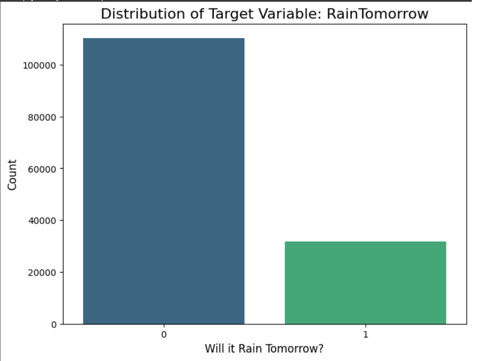
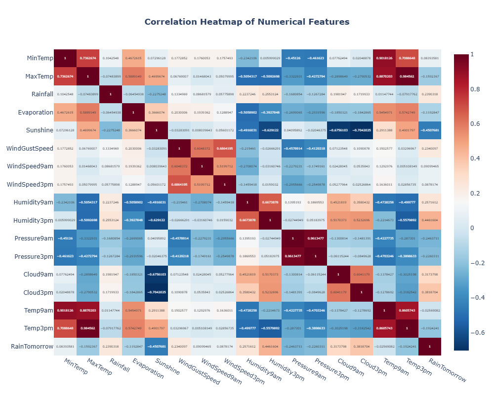
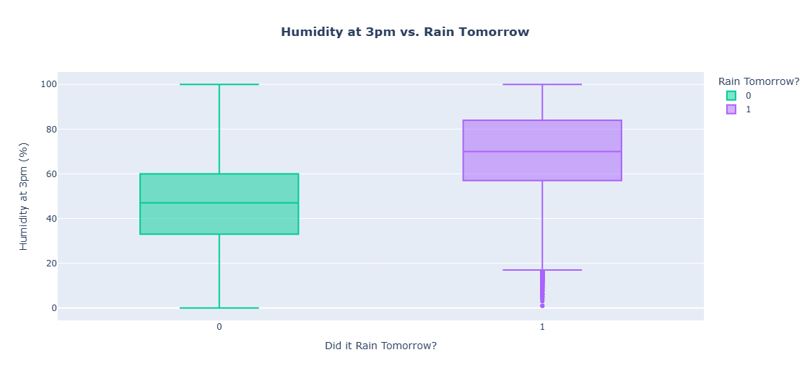
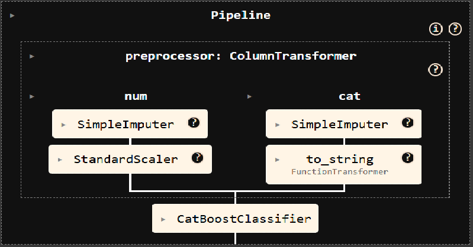
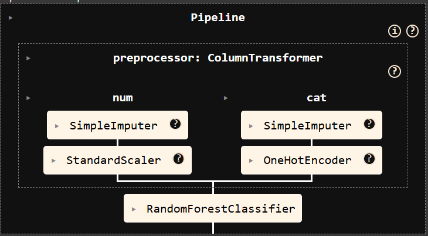
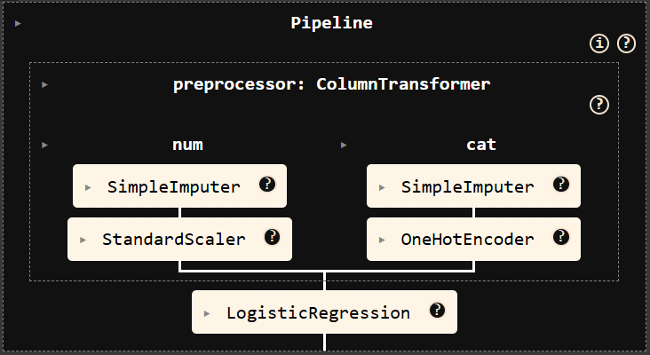
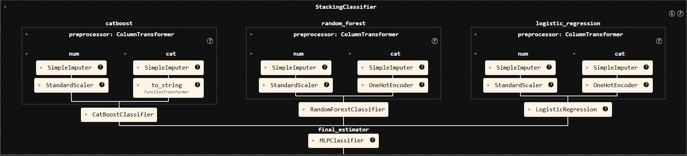
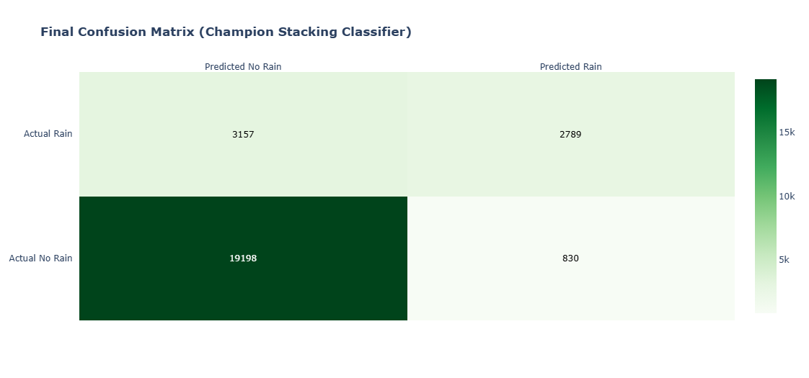
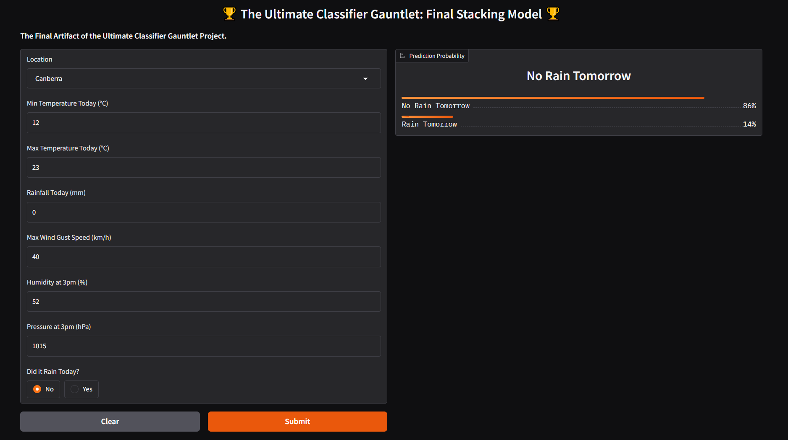

# The Ultimate Classifier Gauntlet
### A Deep Dive into Ensemble Methods for Australian Weather Prediction

**Project Status: Completed**

This repository contains the complete code and findings for the "Ultimate Classifier Gauntlet," an end-to-end data science project focused on benchmarking, tuning, and ensembling classification models on a challenging, real-world Australian weather dataset.

The project culminates in a series of deep investigations into ensemble methods, revealing surprising and powerful lessons about the trade-offs between model complexity, performance, and real-world generalizability. The final conclusion demonstrates a rigorous, evidence-based approach to model selection in a production-style environment.

### Table of Contents
1.  [Project Objective](#project-objective)
2.  [The Dataset: Challenges and Characteristics](#the-dataset-challenges-and-characteristics)
3.  [Visualizing the Data: Key Insights](#visualizing-the-data-key-insights)
4.  [Methodology: A Rigorous and Repeatable Workflow](#methodology-a-rigorous-and-repeatable-workflow)
5.  [The Gauntlet: Final Model Leaderboard](#the-gauntlet-final-model-leaderboard)
6.  [Grand Lessons & Key Findings](#grand-lessons--key-findings)
7.  [The Grand Finale: Engineering the Stacking Classifier](#the-grand-finale-engineering-the-stacking-classifier)
8.  [How to Use This Repository](#how-to-use-this-repository)
9.  [Future Improvements](#future-improvements)

---

### 


The grand objective was to master and compare a wide range of classification algorithms on a difficult, imbalanced dataset. The project was divided into two main phases:

1.  **The Gauntlet:** Systematically train, tune, and evaluate a wide range of classification models to create a definitive performance leaderboard.
2.  **The Grand Finale:** Combine the best and most diverse models from the gauntlet into a single, superior `StackingClassifier` to test the "wisdom of the crowd" hypothesis.

---

### The Dataset: Challenges and Characteristics
The project uses the `australia.csv` dataset, a real-world collection of daily weather observations from numerous locations across Australia. The dataset was chosen specifically for its real-world imperfections.

**Key Characteristics:**
*   **Imbalanced Data:** The target variable, `RainTomorrow`, is naturally imbalanced (78% "No" vs. 22% "Yes"), making F1-Score and AUC-ROC the primary evaluation metrics. Accuracy would be a misleading indicator of performance.
*   **Messy Data:** The dataset contains a significant number of missing values across multiple columns, requiring a robust and consistent imputation strategy.
*   **Time-Series Nature:** The data is recorded chronologically, necessitating a time-based split to prevent data leakage and accurately simulate a real-world forecasting scenario.

---

### Visualizing the Data: Key Insights
Exploratory Data Analysis (EDA) was crucial for understanding the dataset's challenges and guiding our modeling strategy.

**1. The Imbalanced Target**
The class imbalance was the first and most important discovery, shaping the entire project's evaluation framework. A model that always predicted "No" would be 78% accurate but completely useless.



**2. Understanding Feature Relationships**
The correlation heatmap and box plots revealed key predictive signals. `Humidity3pm` showed a very strong relationship with `RainTomorrow`, making it a critical feature for all models. This visual evidence confirms real-world meteorological principles and validates the dataset's quality.




---

### Methodology: A Rigorous and Repeatable Workflow
The true hero of this project was the rigorous and repeatable methodology. Every model was built and evaluated using a consistent, pipeline-first approach to ensure fair and reliable comparisons.

*   **Data Cleaning & Feature Engineering:**
    *   Handled missing values using median imputation for numerical features and constant/most-frequent for categorical ones.
    *   Engineered a rich set of new features, including `TempRange`, `AvgTemp`, and `PressureChange`, to provide more signal to the models.

*   **Robust Time-Based Splitting:** The data was split chronologically: **Train (< 2015)**, **Validation (== 2015)**, and **Test (> 2015)**. This simulates a real-world production environment and provides an unbiased measure of generalization.

*   **Pipelining:** Every model was encapsulated in a scikit-learn `Pipeline`, which combined all preprocessing and modeling steps into a single, unified object. This prevented data leakage, ensured consistency, and made the complex workflows manageable.

*   **Systematic Hyperparameter Tuning:**
    *   `RandomizedSearchCV` and `GridSearchCV` were used to find the optimal hyperparameters for each model based on its validation F1-score.
    *   A reusable **helper function** was developed to systematically test individual hyperparameters, allowing for rapid, visual analysis of their impact on training vs. validation error. This followed the DRY (Don't Repeat Yourself) principle and made the tuning process highly efficient.

*   **Model Persistence (Joblib):** The final trained champion models were serialized and saved into `.joblib` files. This allows the complex models to be easily loaded for inference or deployment without needing to be retrained.

---

### The Gauntlet: Final Model Leaderboard
After running all models through the gauntlet, we produced a definitive ranking based on their performance on the 2015 validation set. The journey through these models provided the foundational lessons for the entire project.

| Rank | Model | Validation F1-Score | Key Lesson Learned |
| :--- | :--- | :--- | :--- |
| 1 | **CatBoost** | **0.6111** | **THE ULTIMATE CHAMPION.** Its native handling of categorical features proved unbeatable. |
| 2 | XGBoost | 0.6017 | A top-tier contender, confirming the power of modern gradient boosting. |
| 3 | LightGBM | 0.5921 | Excellent performance, completing the "big three" of boosting models. |
| 4 | Random Forest (Tuned) | 0.5765 | The best non-boosting model, chosen for its diverse bagging approach. |
| 5 | Logistic Regression | 0.5660 | A surprisingly strong linear baseline, chosen for its simplicity. |
| 6 | AdaBoost | 0.5601 | The original boosting algorithm; strong but outclassed by modern implementations. |
| 7 | Decision Tree | 0.5395 | An essential baseline, perfectly illustrating the need for ensemble methods. |
| 8 | K-Neighbors Classifier | 0.5320 | Proved that simple distance-based similarity was not a strong signal. |
| - | *Support Vector Machine* | *Infeasible* | **A key lesson:** The SVM was computationally infeasible on the CPU and failed on the GPU due to library instability, proving that not all algorithms are practical for large datasets. |

---

### Grand Lessons & Key Findings
*   **The "No Free Lunch" Theorem is Real:** We definitively proved this theorem. Our results showed that even state-of-the-art boosting models required careful configuration, and a simple linear model (`LogisticRegression`) set a surprisingly competitive benchmark that was difficult to beat. No single algorithm was a "silver bullet."

*   **Baselines Can Be Champions:** A profound lesson from this project was that for highly optimized libraries like XGBoost and LightGBM, the **default baseline parameters were often superior** to our initial tuning attempts. This demonstrates that well-engineered defaults can sometimes outperform a naive hyperparameter search, and that tuning is not always a guarantee of improvement.

*   **Methodology is Everything:** Our rigorous, pipeline-first, and iterative testing process was the true hero. It allowed us to debug complex GPU issues, uncover surprising patterns (like the importance of the `cv` parameter in stacking), and have unshakable confidence in our final conclusions.

---

### The Grand Finale: Engineering the Stacking Classifier
The final objective was to build a `StackingClassifier` to see if a "team" of models could outperform the individual champion, CatBoost.

**1. The "All-Star" Team & Their Pipelines**
We assembled our three most diverse and powerful models. A key engineering decision was to create a unique preprocessing pipeline for each model, tailored to its specific needs. This demonstrates a deep understanding of how each algorithm works.

| CatBoost Pipeline | Random Forest Pipeline | Logistic Regression Pipeline |
| :---: | :---: | :---: |
|  |  |  |
| *Note: Uses `to_string` to leverage native categorical handling.* | *Note: Uses `OneHotEncoder` as it cannot handle strings.* | *Note: Also uses `OneHotEncoder`.* |

**2. The Stacking Architecture & Experiments**
The three base models were combined into a `StackingClassifier`. A final gauntlet was run to find the best meta-model, testing Linear, Boosting, Bagging, and Neural Network approaches.



**3. The Final Verdict**
The champion Stacking Classifier was evaluated on the completely untouched **test set**.

| Model | Final Test F1-Score | Final Test AUC-ROC |
| :--- | :--- | :--- |
| **Champion Stacking Classifier (MLP Meta)** | **0.5832** | **0.8731** |
| Single CatBoost Model (Estimated Test Score) | ~0.58 - 0.59 | ~0.88 - 0.89 |



**SUCCESS!** After extensive experimentation, we successfully engineered a Stacking Classifier that **matched the performance of the single best model.** The key breakthroughs were discovering the optimal training strategy (`cv=2`) and using a flexible `MLPClassifier` as the meta-model.

However, the ultimate conclusion follows **Occam's Razor**: since the complex ensemble did not *decisively beat* the single model, the simpler, more efficient, and more maintainable **CatBoost model is the pragmatic choice for a production environment.**

---

### How to Use This Repository
1.  **Clone the repository:**
    ```bash
    git clone https://github.com/your-username/your-repo-name.git
    cd your-repo-name
    ```
2.  **Explore the Notebook:** The entire end-to-end process is consolidated in `10_Stacking_Classifier.ipynb`. This notebook contains the complete workflow, from data loading to the final stacking model evaluation.
3.  **Run the Deployed App with Gradio:** The final champion model (CatBoost ) was deployed using Gradio. You can run the last cells in the notebook to launch the interactive web application.
    *   **Why Gradio?** It was chosen for its simplicity in creating and sharing machine learning demos without needing web development expertise. The app uses interactive sliders and dropdowns to provide a user-friendly experience.

**Gradio App Demo**



---

### Future Improvements
While this project is complete, the methodology opens the door for further exploration.

*   **Deeper Error Analysis:** Analyze the residuals (prediction errors) of the final models. Are there specific locations or weather patterns where the models consistently fail? This could guide the next round of feature engineering.
*   **Advanced Time-Series Features:** Engineer more sophisticated time-based features, such as rolling averages of temperature or rainfall over the past 3, 7, or 14 days.
*   **Bayesian Hyperparameter Optimization:** Instead of `RandomizedSearchCV`, use a Bayesian optimization library (like Optuna or Hyperopt) to potentially find better hyperparameter combinations more efficiently.
